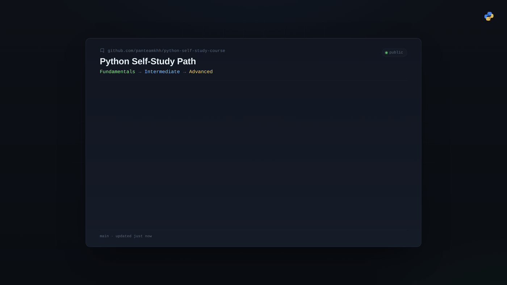

<div align="center">

# 🐍 Python Self-Study Path
### Fundamentals → Intermediate → Advanced

A complete, self-paced Python course, from zero to advanced level, designed for independent learning without needing videos.

[](https://www.python.org/)
[](#full-lesson-list-1-to-15)
[](#how-to-study)
[](#license)



</div>

---

Each lesson is a complete unit including conceptual explanation, runnable examples, exercises, an answer key, and a quiz.

This repository is made up of three parts that should be studied in sequence. Lesson numbers are continuous across the whole repo (1 to 15) so the learning path is clear and unambiguous.

---

## Course Structure

| Part | Title | Lessons | Description |
|---|---|---|---|
| 📗 [01-python-fundamentals](./01-python-fundamentals) | Python Fundamentals | Lessons 1–5 | Python basics, for people with no programming experience |
| 📘 [02-python-intermediate](./02-python-intermediate) | Python Intermediate | Lessons 6–10 | Data structures, functions, and error handling |
| 📙 [03-python-advanced](./03-python-advanced) | Python Advanced | Lessons 11–15 | Object-oriented programming, special methods, and generators |

---

## Full Lesson List (1 to 15)

### 📗 Part One — Python Fundamentals (Lessons 1–5)

| # | Lesson | Topic |
|---|---|---|
| 01 | [Lesson-01-Your-First-Program](./01-python-fundamentals/Lesson-01-Your-First-Program) | `print()`, comments, program execution order |
| 02 | [Lesson-02-Variables-and-Data-Types](./01-python-fundamentals/Lesson-02-Variables-and-Data-Types) | Variables, `int`, `float`, `str`, `bool`, `type()` |
| 03 | [Lesson-03-Working-with-Numbers](./01-python-fundamentals/Lesson-03-Working-with-Numbers) | Arithmetic operators, integer division, modulus, exponentiation |
| 04 | [Lesson-04-Type-Conversion](./01-python-fundamentals/Lesson-04-Type-Conversion) | `int()`, `float()`, `str()`, `bool()` and type conversion notes |
| 05 | [Lesson-05-Comparison-and-Boolean-Logic](./01-python-fundamentals/Lesson-05-Comparison-and-Boolean-Logic) | `==`, `!=`, `<`, `>`, `and`, `or`, `not` |

📄 Quick reference: [CheatSheet-Part-01.md](./01-python-fundamentals/CheatSheet-Part-01.md)

### 📘 Part Two — Python Intermediate (Lessons 6–10)

| # | Lesson | Topic |
|---|---|---|
| 06 | [Lesson-06-Sets-and-Operations](./02-python-intermediate/Lesson-06-Sets-and-Operations) | Sets and set operations |
| 07 | [Lesson-07-Defining-Functions](./02-python-intermediate/Lesson-07-Defining-Functions) | Defining functions |
| 08 | [Lesson-08-Arguments-and-Scope](./02-python-intermediate/Lesson-08-Arguments-and-Scope) | Arguments and variable scope |
| 09 | [Lesson-09-Higher-Order-Functions](./02-python-intermediate/Lesson-09-Higher-Order-Functions) | Higher-order functions |
| 10 | [Lesson-10-Try-and-Except](./02-python-intermediate/Lesson-10-Try-and-Except) | Error handling with `try` and `except` |

📄 Quick reference: [CheatSheet-Part-02.md](./02-python-intermediate/CheatSheet-Part-02.md)

### 📙 Part Three — Python Advanced (Lessons 11–15)

| # | Lesson | Topic |
|---|---|---|
| 11 | [Lesson-11-Classes-and-Objects](./03-python-advanced/Lesson-11-Classes-and-Objects) | Classes and objects |
| 12 | [Lesson-12-Inheritance-and-Polymorphism](./03-python-advanced/Lesson-12-Inheritance-and-Polymorphism) | Inheritance and polymorphism |
| 13 | [Lesson-13-Special-Methods](./03-python-advanced/Lesson-13-Special-Methods) | Special methods / dunder methods |
| 14 | [Lesson-14-Generators-and-Yield](./03-python-advanced/Lesson-14-Generators-and-Yield) | Generators and `yield` |
| 15 | [Lesson-15-Generator-Expressions](./03-python-advanced/Lesson-15-Generator-Expressions) | Generator expressions |

📄 Quick reference: [CheatSheet-Part-03.md](./03-python-advanced/CheatSheet-Part-03.md)

---

## Structure of Each Lesson

Every `Lesson-XX-Topic-Name` folder contains exactly these files:

```text
Lesson-XX-Topic-Name/
├── lesson.md       Full lesson: concepts, examples, common mistakes
├── examples.py     All lesson examples, ready to run
├── exercise.md      Hands-on exercises (easy to hard) — questions only
├── solution.py      Complete, explained solution for each exercise
└── quiz.md          End-of-lesson quiz with answer key
```

## How to Study

1. Read `lesson.md` all the way through.
2. Run `examples.py` yourself and experiment with changing values.
3. Solve the exercises in `exercise.md` without looking at the solution.
4. Compare your answers with `solution.py`.
5. Take the `quiz.md` to make sure you've learned the material.
6. Move on to the next lesson following the continuous numbering (1 to 15).

> Note: each section (fundamentals / intermediate / advanced) also has its own dedicated `README.md`, which is the original, more detailed version of that section's description.

## Prerequisites

- Python 3 installed (`python3 --version`)
- A text editor
- A terminal / command line

No other software or accounts are required.

## License

This course is provided solely for personal, self-study use.
